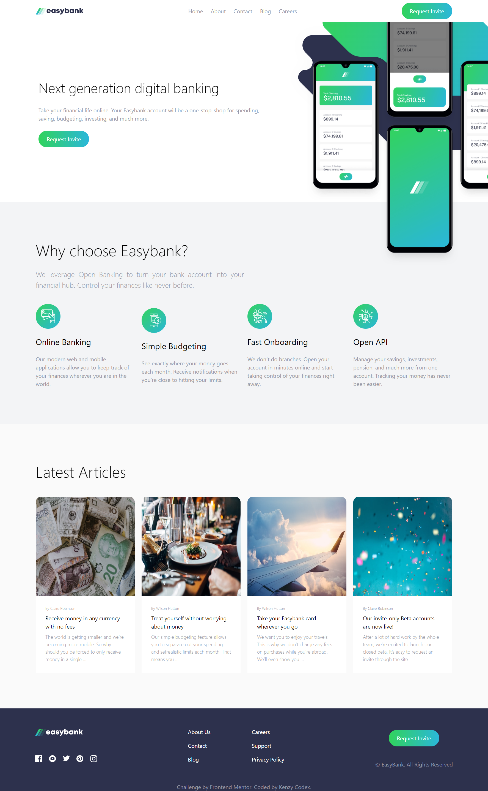

# Easybank Landing Page (React-based)

This is a solution to the [Easybank landing page challenge on Frontend Mentor](https://www.frontendmentor.io/challenges/easybank-landing-page-WaUhkoDN). Frontend Mentor challenges help you improve your coding skills by building realistic projects.

Take your financial life online. Your Easybank account will be a one-stop-shop for spending, saving, budgeting, investing, and much more.
## Table of contents

- [Overview](#overview)
  - [The challenge](#the-challenge)
  - [Screenshot](#screenshot)
  - [Links](#links)
- [My process](#my-process)
  - [Built with](#built-with)
- [Author](#author)

## Overview

### The challenge

Users should be able to:

- View the optimal layout for the site depending on their device's screen size
- See hover states for all interactive elements on the page

### Screenshot

### Links

- [Solution URL](https://www.frontendmentor.io/solutions/easybank-landing-page-react-based-GHW04Mpcx4) 
- [Live Site URL](https://easy-bank-landing-page-henna.vercel.app)

## My process

### Built with

- Semantic HTML5 markup
- CSS custom properties
- Flexbox
- Mobile-first workflow
- [React](https://reactjs.org/) - JS library
- [Styled Components](https://styled-components.com/) - For styles

## Author

- Frontend Mentor - [@kenzycodex](https://www.frontendmentor.io/profile/kenzycodex)
- Kenzy Codex Portfolio - [@kenzycodex](https://kenzycodex.vercel.app)
